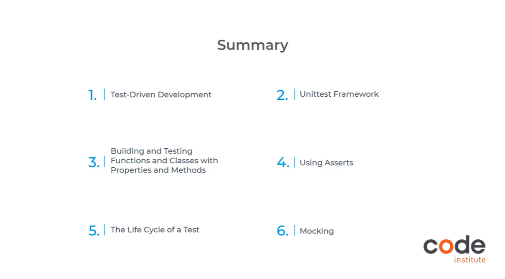

# Unit-testing

As part of my Diploma in Full Stack Software Development with Code Institute:

- I revised test-driven development (TDD) and red-green-refactoring
- I learnt about the Unittest framework and how to build functions, classes and methods using Test-Driven Development
- I learnt how to leverage asserts to test various aspects of my code
- The life cycle of a test
- I learnt how to use mocking to test aspects of the code that may fail due to external factors

